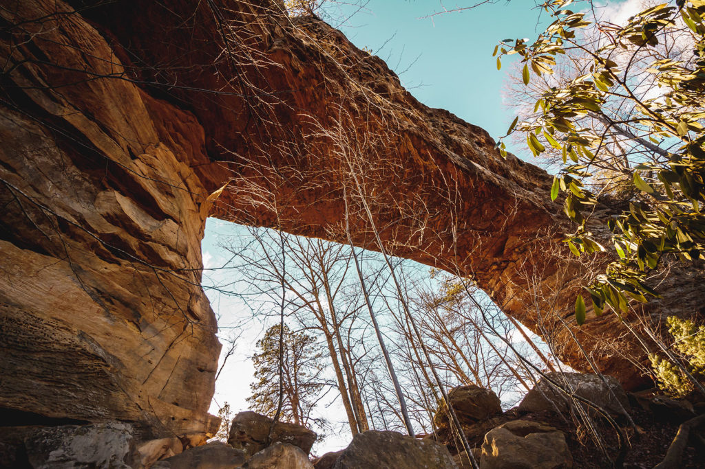
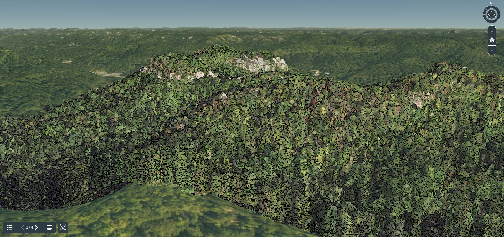
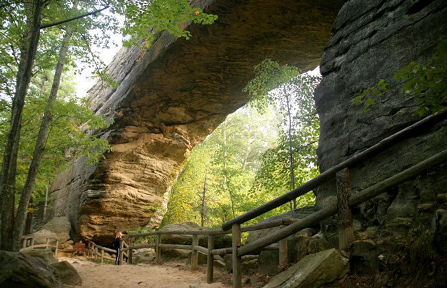
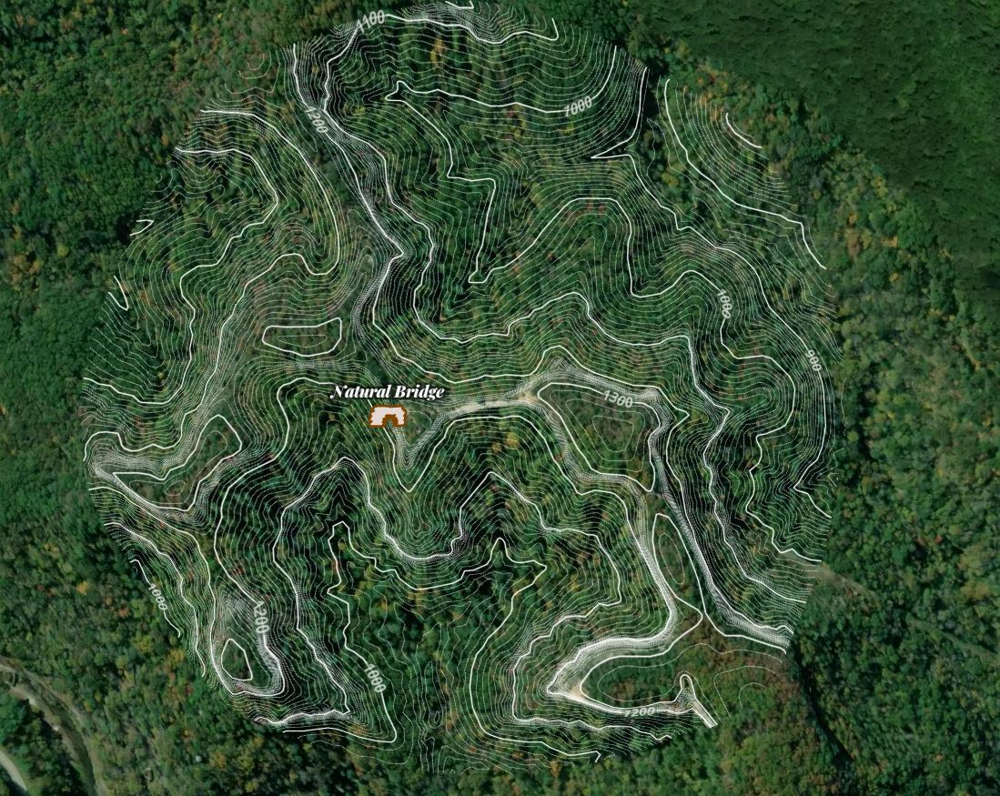

# Natural Bridge
    
*The sandstone arch known as Natural Bridge, captured by Bailey, B (1995)*

# Introduction
Natural Bridge State Park is a ~3.5 square mile Kentucky state park located in Slade, KY at 37.7769° N, 83.6884° W. Natural Bridge is a sandstone arch that runs 78 feet across and peaks at 65 feet tall [(source)](https://stateparks.com/natural_bridge_state_park_in_kentucky.html). The goal of this project is to create a virtual experience of Natural Bridge State Park that will create a feeling of reality for viewers from the comfort of their home. Another objective was to accurately depict the contour changes throughout the area of interest to provide additional depth of visualization.

## Visualization of Natural Bridge
    
*A screenshot of the virtual tour created with Cesium Ion.*

Follow [this link](https://cesium.com/ion/stories/viewer/?id=3e504b65-0bb4-4eb8-bcb6-4423c66fb050) to take a tour of Natural Bridge State Park. Also, with this interactive map you can explore other views that may be of interest.

## Trail View
    
*View of the arch from one of many hiking trails running through this state park, retrieved from Kentucky Tourism, Arts and Heritage Cabinet.*

## Contour Imagery of Natural Bridge
    
*A screenshot of the interactive map created with Mapbox.*

Follow [this link](https://api.mapbox.com/styles/v1/ncho225/ckohdr0ka2snx17pgowoeuksc.html?fresh=true&title=view&access_token=pk.eyJ1IjoibmNobzIyNSIsImEiOiJja2tib3g1d2wwMWt2MnZwaXoyOGx2ZXZiIn0.JUzbwNRH7s0z0fX_Je4sWQ) to access this interactive map of Natural Bridge with added terrain and contour imagery. Zooming in will allow you to view the layout of hiking and cycling trails.

## Sources and Tools
Imagery was created by Colton Howard for the University of Kentucky Department of Geography, Spring 2021. This presentation is a final project created for GEO 409.

LAS data was retrieved from [KyFromAbove](https://kyfromabove.ky.gov/) project. 2018 NAIP imagery downloaded from the ftp://kymartian.ky.gov. 

Tools
* ArcPy & ArcGIS Pro
* Python modules subprocess, zip, etc.
* Potree point cloud renderer

Platforms
* Cesium ion
* Mapbox

*University of Kentucky GEO 409, 2021.*

